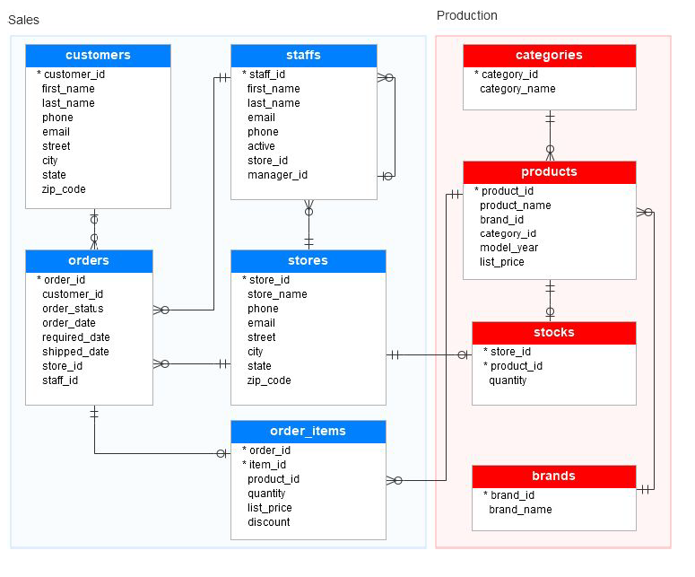

### Projet Local Bike dans le cadre de la formation Analytics Engineer

Pour avoir plus d'information [programme](https://www.data-bird.co/formation-data-engineer/analytics-engineer-databird-datagen)

### Modèle de données 

### Objectifs

1. Définir les axes d’analyse :
    - Identifier des axes d'analyse permettant d'aider l'équipe des opérations.
    - Le but final est de leur permettre d’optimiser au mieux les ventes et de
maximiser le revenu de l'entreprise grâce aux insights obtenus.
2. Modélisation des données :
    - Importer les données brutes dans BigQuery.
    - Structurer les données dans un projet DBT pour faciliter les analyses.
3. Implémentation des tests et documentation :
    - Ajouter des tests et une documentation complète, en particulier pour les modèles qui seront connectés aux tableaux de bord.
4. Visualisation et partage :
    - Héberger le projet sur Github pour pouvoir permettre de faire une Peer-Review.
    - Créer une ou plusieurs visualisations dans l'outil de BI de votre choix     (Métabase, Power BI, Tableau) pour présenter les insights de manière visuelle.
5. Bonus: Création de dashboard et analyse
    - Effectuer une analyse complète en créant un dashboard pour répondre à la problématique d’optimisation des revenus de Local Bike

