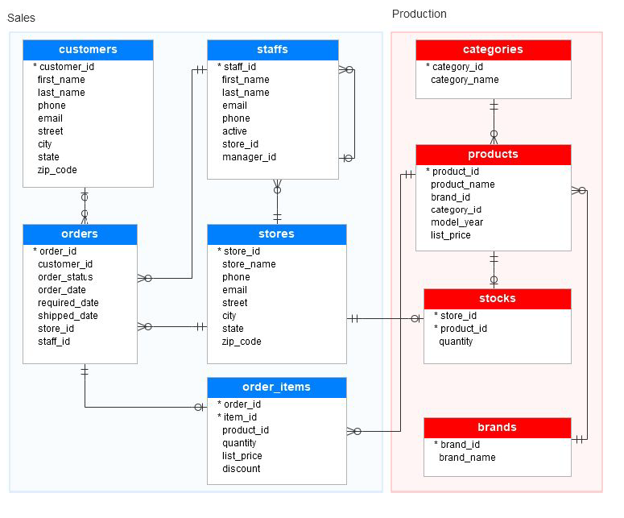
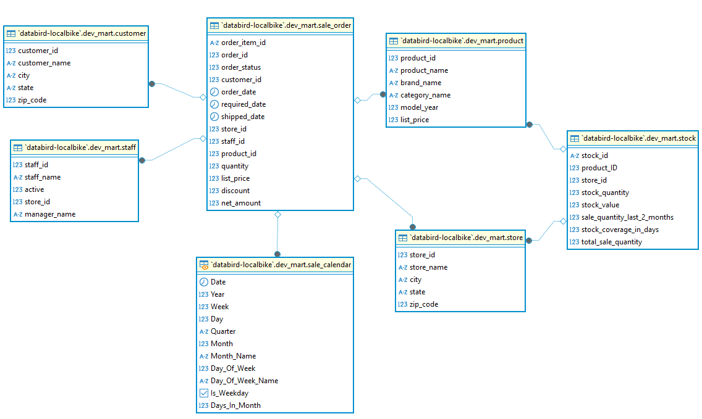
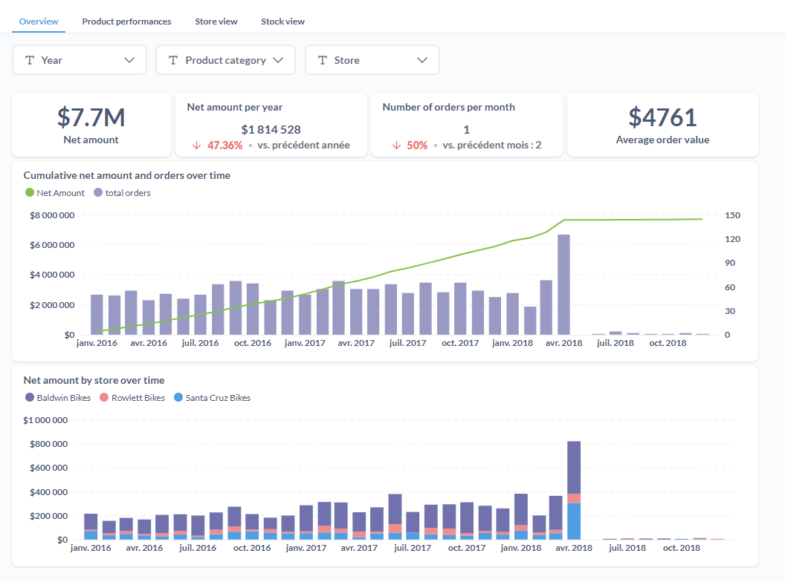
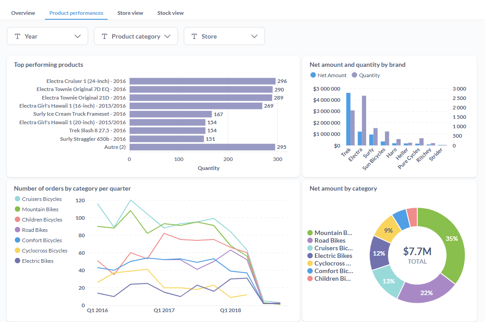
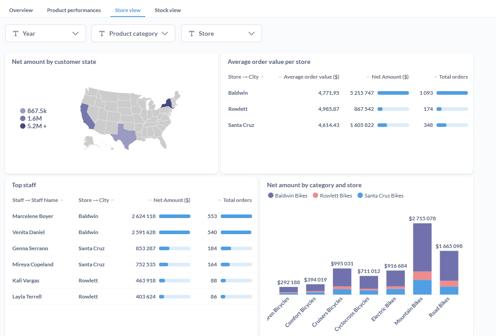
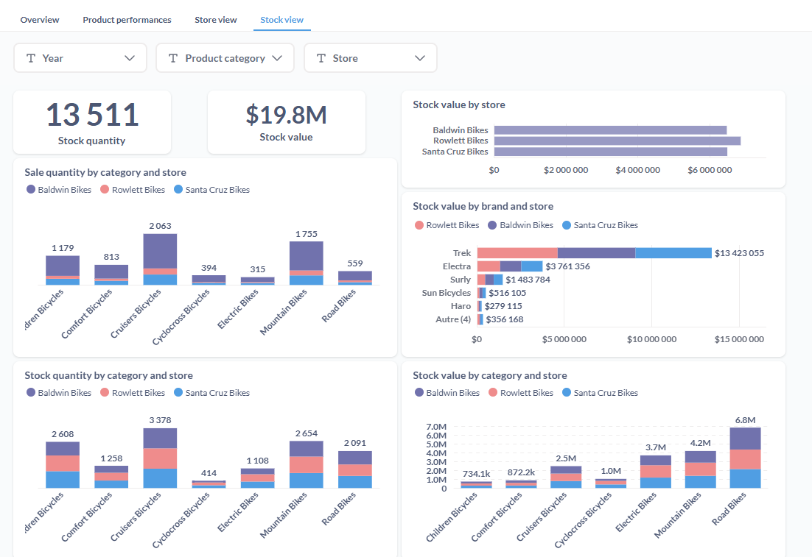

### Projet Local Bike développé dans le cadre de la formation Analytics Engineer

Pour avoir plus d'informations [lien vers Databird](https://www.data-bird.co/formation-data-engineer/analytics-engineer-databird-datagen)

### Modèle de données 

### Objectifs

1. Définir les axes d’analyse :
    - Identifier des axes d'analyse permettant d'aider l'équipe des opérations.
    - Le but final est de leur permettre d’optimiser au mieux les ventes et de
maximiser le revenu de l'entreprise grâce aux insights obtenus.
2. Modélisation des données :
    - Importer les données brutes dans BigQuery.
    - Structurer les données dans un projet DBT pour faciliter les analyses.
3. Implémentation des tests et documentation :
    - Ajouter des tests et une documentation complète, en particulier pour les modèles qui seront connectés aux tableaux de bord.
4. Visualisation et partage :
    - Héberger le projet sur Github pour pouvoir permettre de faire une Peer-Review.
    - Créer une ou plusieurs visualisations dans l'outil de BI de votre choix     (Métabase, Power BI, Tableau) pour présenter les insights de manière visuelle.
5. Bonus: Création de dashboard et analyse
    - Effectuer une analyse complète en créant un dashboard pour répondre à la problématique d’optimisation des revenus de Local Bike

### Modèle mart proposé

Il s'agit d'une modélisation "Star schema" en vue d'un usage Self Service via Metabase

- 2 tables de faits
    * Sale Order : table des commandes des ventes au niveau jour\client\produit\magasin\équipe
    * Stock : table des stocks à date au niveau produit\magasin
    
- tables de dimensions
    * product : id, nom du produit, marque et catégorie
    * customer : id, nom du client, état géographique
    * store : id, nom du magasin, état géographique        
    * staff : id, nom du vendeur, nom du manager, id du magasin
    * sale_calendar : calendrier pour simplifier les analyses sur l'axe temps

### Modèles dbt

[Voir les modèles dbt](https://beng78.github.io/databird_localbike_dbt)

### Dashboard Metabase

4 onglets ont été réalisés pour analyser quelques données du dataset fourni

1- Onglet Overview

2 - Onglet Product performances

2- Onglet Store view

4- Onglet Stock view

